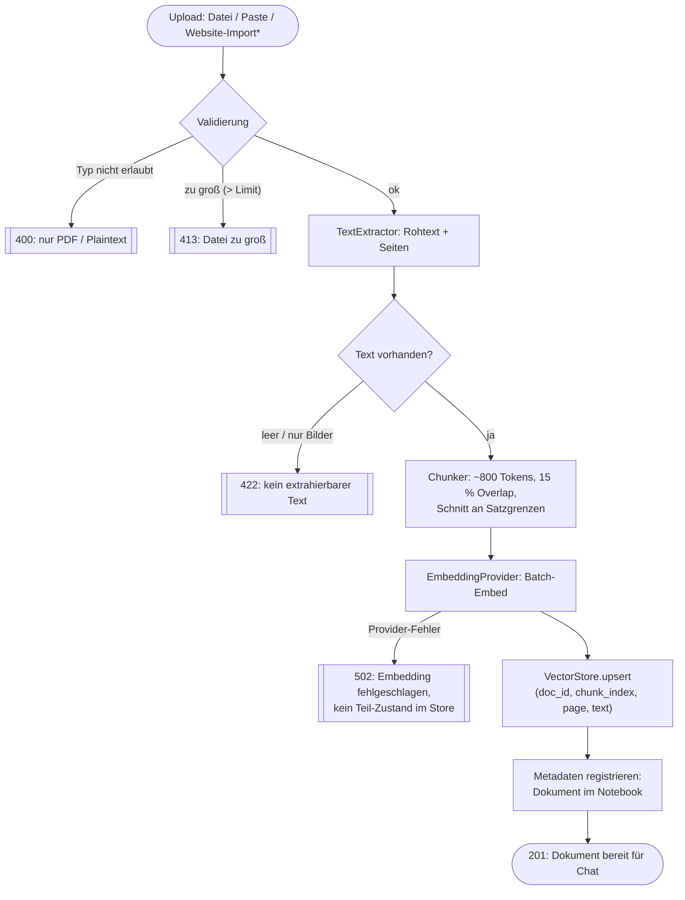

# D4 · Aktivitätsdiagramm — Ingest-Pipeline

Fehlerpfade sind Teil des Vertrags: Upload-Validierung (Typ-Whitelist, Größenlimit),
leere PDFs werden abgewiesen statt stumm 0 Chunks zu erzeugen, und ein Metadaten-Fehler
nach dem Vektor-Upsert rollt die Vektoren zurück (kein halb-ingestierter Zustand).

\* Der Website-Import durchläuft VOR diesem Diagramm den `WebPageFetcher` mit
SSRF-Guard und Extraktion ([ADR-009](adr/ADR-009-url-import-ssrf.md)) — der
extrahierte Text kommt dann als Plaintext in genau diesen Pfad.
