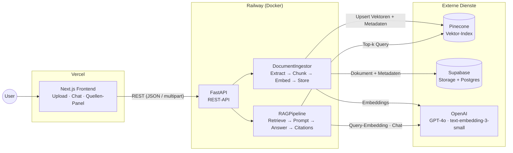

# D1 · Komponenten-/Architekturdiagramm

Getrenntes Frontend + eigenständiger Python-RAG-Service ([ADR-001](adr/ADR-001-frontend-backend-split.md)).

**Datenfluss:** Upload → Extract (pypdf) → Chunk (~800 Tokens, 15 % Overlap) → Embed →
Vektor-Store (Metadaten: doc_id, chunk_index, page, text) → Chat: Query-Embedding →
Top-k Retrieval → Prompt mit nummerierten Quellen-Chunks → Antwort mit `[n]`-Zitaten →
Frontend mappt Zitate auf Chunks.

**Provider-Grenze:** OpenAI, Pinecone und Supabase liegen hinter Interfaces
([ADR-006](adr/ADR-006-provider-abstraction.md)); im Fake-Modus ersetzt sie ein
deterministisches In-Memory-Setup (Tests, CI, Offline-Demo).
