# D2 · UML-Klassendiagramm — RAG-Kern

OOP-Design mit ABCs und Dependency Injection ([ADR-007](adr/ADR-007-oop-design.md)).

```mermaid
classDiagram
    direction TB

    class DocumentIngestor {
        -extractors: dict~str, TextExtractor~
        -chunker: Chunker
        -embedder: EmbeddingProvider
        -store: VectorStore
        +ingest(file_bytes, filename, notebook_id) IngestResult
    }

    class TextExtractor {
        <<abstract>>
        +extract(data: bytes) list~PageText~
    }
    class PdfExtractor
    class PlainTextExtractor

    class Chunker {
        -chunk_size: int
        -overlap: int
        +chunk(pages: list~PageText~) list~Chunk~
    }

    class EmbeddingProvider {
        <<abstract>>
        +embed(texts: list~str~) list~vector~
    }
    class OpenAIEmbeddings
    class FakeEmbeddings

    class VectorStore {
        <<abstract>>
        +upsert(chunks, vectors, namespace)
        +query(vector, top_k, namespace) list~ScoredChunk~
        +delete_document(doc_id, namespace)
    }
    class PineconeStore
    class InMemoryVectorStore

    class RAGPipeline {
        -retriever: Retriever
        -prompt_builder: PromptBuilder
        -llm: LLMProvider
        -citation_mapper: CitationMapper
        +answer(question, notebook_id) ChatAnswer
    }

    class Retriever {
        -embedder: EmbeddingProvider
        -store: VectorStore
        -top_k: int
        +retrieve(question, notebook_id) list~ScoredChunk~
    }

    class PromptBuilder {
        +build(question, chunks) list~Message~
    }

    class LLMProvider {
        <<abstract>>
        +complete(messages) LLMResponse
    }
    class OpenAIChat
    class FakeLLM

    class CitationMapper {
        +map(answer_text, chunks) ChatAnswer
    }

    class StudioService {
        -repository: NotebookRepository
        -llm: LLMProvider
        +suggested_questions(notebook_id)
        +report(notebook_id)
        +flashcards(notebook_id)
        +quiz(notebook_id)
        +mindmap(notebook_id)
    }

    class AudioOverviewService {
        -repository: NotebookRepository
        -llm: LLMProvider
        -tts: TTSProvider
        +generate(notebook_id) AudioOverview
    }

    class TTSProvider {
        <<abstract>>
        +synthesize(text) Speech
    }
    class OpenAITTS
    class FakeTTS

    class WebPageFetcher {
        -timeout, max_bytes
        +fetch(url) FetchedPage
    }

    TextExtractor <|-- PdfExtractor
    TextExtractor <|-- PlainTextExtractor
    EmbeddingProvider <|-- OpenAIEmbeddings
    EmbeddingProvider <|-- FakeEmbeddings
    VectorStore <|-- PineconeStore
    VectorStore <|-- InMemoryVectorStore
    LLMProvider <|-- OpenAIChat
    LLMProvider <|-- FakeLLM

    DocumentIngestor o-- TextExtractor
    DocumentIngestor o-- Chunker
    DocumentIngestor o-- EmbeddingProvider
    DocumentIngestor o-- VectorStore

    RAGPipeline o-- Retriever
    RAGPipeline o-- PromptBuilder
    RAGPipeline o-- LLMProvider
    RAGPipeline o-- CitationMapper

    Retriever o-- EmbeddingProvider
    Retriever o-- VectorStore

    TTSProvider <|-- OpenAITTS
    TTSProvider <|-- FakeTTS
    StudioService o-- LLMProvider
    AudioOverviewService o-- LLMProvider
    AudioOverviewService o-- TTSProvider
```

Alle Abhängigkeiten werden per Konstruktor injiziert; die Komposition passiert an genau
einer Stelle (`app/main.py`, Composition Root). Fakes implementieren dieselben ABCs —
Tests brauchen kein Patching.
