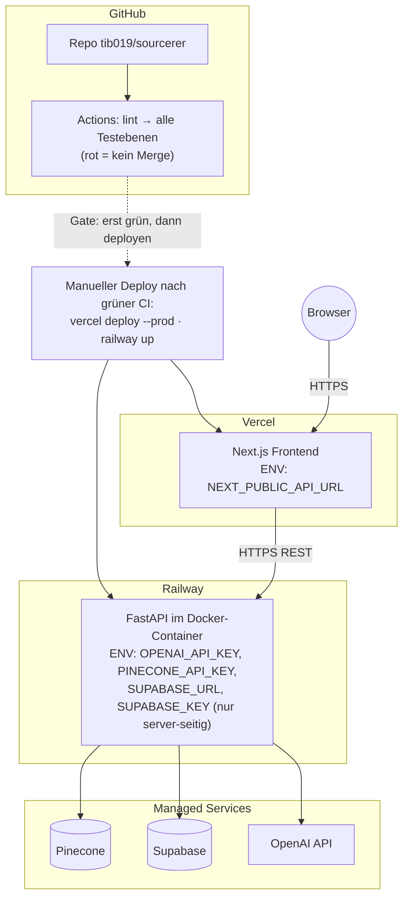

# D6 · Deployment-Diagramm

- **Secrets** liegen ausschließlich in Railway-Env-Variablen (server-seitig); das
  Frontend kennt nur die API-URL.
- **CORS:** Backend erlaubt genau den Vercel-Origin.
- **CI-Gate:** Lint + alle Testebenen (unit, math, eval, TS-unit, E2E) laufen bei jedem
  Push. Deploys erfolgen manuell per CLI (`railway up`, `vercel deploy --prod`) —
  Regel: nur bei grünem `main` (Auto-Deploy wäre der nächste Ausbauschritt).
