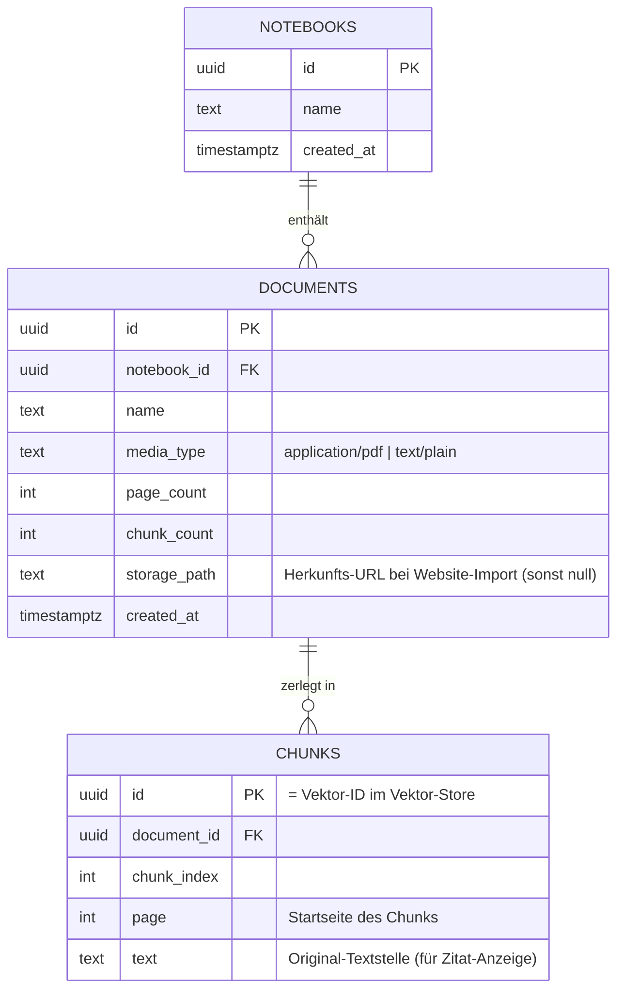

# D5 · ER-Diagramm — Metadaten-Schema (Supabase / Postgres)

**Doppelrolle der CHUNKS-Zeile:** dieselben Felder liegen als Metadaten am Vektor im
Vektor-Store (Pinecone) — das Retrieval liefert damit direkt alles, was der
`CitationMapper` und das Quellen-Panel brauchen, ohne zweiten Lookup.
Der Vektor-Namespace ist die `notebook_id` → Quellen sind pro Notebook isoliert.

**Demo-Scope:** im MVP bedient eine In-Memory-Repository-Implementierung dieses Schema;
die Supabase-Implementierung ist dieselbe Schnittstelle (siehe NOTES.md §6).
