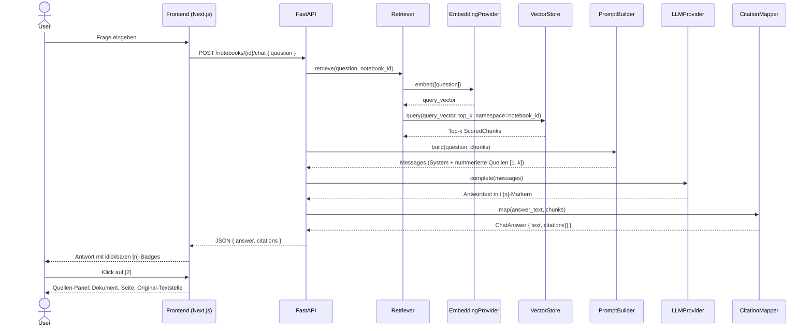

# D3 · Sequenzdiagramm — „Frage → zitierte Antwort"

Sonderfall **keine belastbare Quelle**: Findet das Retrieval nichts Relevantes bzw. steht
die Antwort nicht in den Chunks, antwortet das System „Dazu steht nichts in den Quellen."
— ohne Zitate, ohne Halluzination (abgesichert im Groundedness-Eval, `tests/eval/`).
